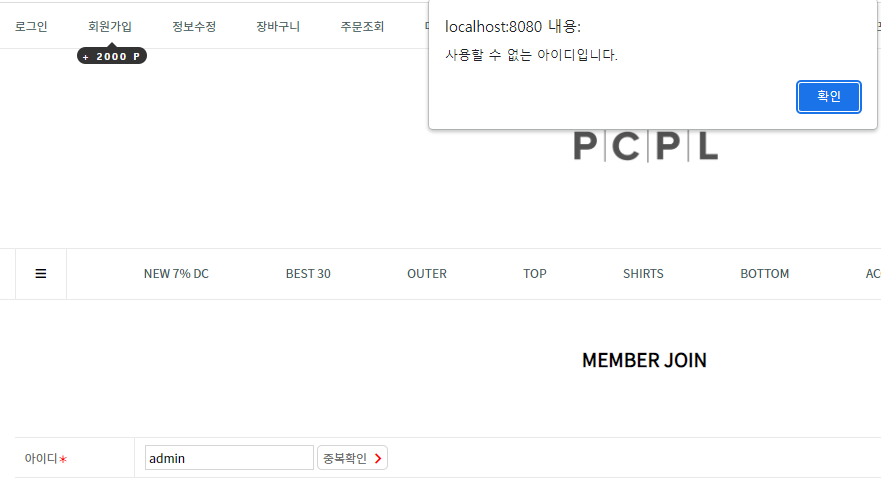

# 🏠 Page27 clone Project
 교육용으로 제작한 page27 쇼핑몰 클론코딩 프로젝트 
 

## 👋 Part 

- 프론트 : 박준원, 채기웅
- 백엔드 : 박상순, 이현도

## 📁 프로젝트 기능

- 회원가입 & 로그인
- 회원 마이페이지를 통한 정보 수정
- 관리자 페이지를 통한 회원, 상품, 주문 관리
- 주소 등록
- 장바구니
- 상품 주문 및 결제

 

## 📕 기술 스택

#### 📙  프론트 엔드

- html
- CSS
- JavaScript(jQuery, Ajax)
- Thymeleaf

#### 📙 백엔드

- Spring Boot
- Spring Data JPA
- Spring Security
- QueryDsl
- H2
- gradle

 

## 📦 개발 환경

- Intellij
- github

 

## 📸 서비스 및 기능

서비스 및 기능

### 메인 화면
- 주요 상품들로 carousel 구성하여 일정 시간마다 움직이도록 구현
- 상품 사진 클릭 시 해당 상품의 상세 페이지로 이동 
  

### 회원가입 / 로그인
🔍 회원가입
 
 

- Ajax를 사용한 ID 중복확인 기능 
 
 

🔍 로그인
- Spring Security 적용 
  

### 관리자 페이지
- ID를 "admin"으로 로그인 시 관리자로 넘어가도록 설정
 

- "admin"이 아닌 다른 ID로 로그인 후 관리자 페이지 접근 시 접근 제한
 

🔍 관리자 메인화면
- 누적 방문자 수 및 상품, 주문, 회원 현황 요약 출력

  

### 관리자 상품 관리
🔍 상품 등록
- Querydsl을 통한 상품 정보 저장
- commons-io 라이브러리를 이용한 이미지 파일 업로드
 

🔍 상품 목록
- Querydsl을 통한 동적 검색 기능 
 

- 상품 상태 변경(판매, 품절) 및 삭제 
  

### 관리자 주문 관리
- Querydsl을 통한 동적 검색 기능 
  

- ### 관리자 페이지

- ### 자동 완성 기능 

- ### 장바구니

- ### 주문 기능

## ✔️ 문제 및 해결

문제 및 해결

- ### 문제 : 웹 크롤링 코드가 한번씩 돌리도록 구성이 되어있어서 너무 많은 시간이 소요됨
- ### 해결 : for문과 switch-case문을 사용하여 각 카테고리별로 한번에 처리되도록 구성

  

- ### 문제 : 크롤링 시 SQL문에서 에러가 발생함

 

- ### 원인 : 크롤링해오는 값이 없을 경우 값이 null로 들어가지 않고 뒤에 텍스트까지 같이 크롤링을 해서 저장범위를 넘어감
- ### 해결 : 변수의 값을 null로 초기화하고 if문으로 값이 있는 경우에만 크롤링하도록 처리

